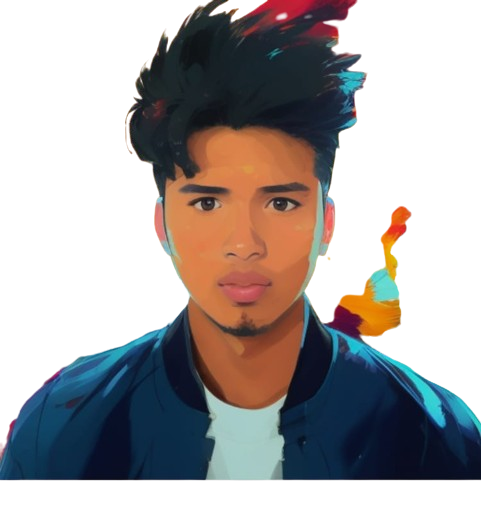

# Portafolio de Omar Felix Rivera Rosas 🚀

<div align="center">
  
  <h3>Desarrollador Backend y Frontend</h3>
</div>

## 📋 Índice
- [Sobre Mí](#sobre-mí)
- [Tecnologías](#tecnologías)
- [Proyectos](#proyectos)
- [Contacto](#contacto)

## 🧑‍💻 Sobre Mí

Soy un apasionado programador de la carrera de sistemas con experiencia en el desarrollo de soluciones tecnológicas innovadoras. Me especializo en:

- 🎯 Análisis de modelos de negocio
- 💡 Desarrollo de soluciones personalizadas
- 🚀 Optimización de procesos empresariales
- 🔄 Implementación de tecnologías modernas

## 🛠️ Tecnologías

### Frontend


### Backend


### Bases de Datos


### Herramientas y Otros


## 💼 Proyectos

### 1. Página Web Centro de Varones
- **Descripción**: Plataforma web para mantener informados a padres de familia y alumnos.
- **Tecnologías**: JavaScript, HTML, CSS, MySQL, Express, NodeJS
- **Demo**: [Ver Video](https://www.youtube.com/watch?v=-IK4olKRqZY&t=18s)

### 2. Sistema de Reservas MachaBarberShop
- **Descripción**: Sistema de administración para barbería (ventas, pagos a barberos, etc.)
- **Tecnologías**: JavaScript, HTML, CSS, SQL Server, Java (Jakarta), Docker
- **Demo**: [Ver Video](https://youtu.be/MRFVRMbrroE)

### 3. Mini Minecraft en Python
- **Descripción**: Recreación del popular juego usando Python
- **Tecnologías**: Python y sus librerías
- **Repositorio**: [GitHub](https://github.com/Omarrivv/juegoMiniMicraft.git)

### 4. Automatización de Envíos por Email
- **Descripción**: Sistema de automatización usando Google Apps Script
- **Tecnologías**: Google Apps Script, Sheets, Forms
- **Demo**: [Ver Video](https://youtu.be/mv5Ns-YKezs)

### 5. Extractor de Videos de YouTube
- **Descripción**: Herramienta educativa para extraer videos usando pytube
- **Tecnologías**: Python, Flask
- **Demo**: [Ver Video](https://youtu.be/-b_KbTlfR8k)

## 📱 Contacto y Redes Sociales

[](https://www.linkedin.com/in/omar-felix-rivera-rosas-149619274/)
[](https://github.com/Omarrivv)
[](https://www.youtube.com/@codefxomarroma)
[](https://www.tiktok.com/@omarrivera4318)

### 📞 Contacto Directo
- WhatsApp: [+51 930720474](https://wa.me/51930720474)

## 🌐 Estructura del Sitio

El portafolio está construido con una arquitectura moderna y responsive:

```
PORTAFOLIO_2025/
├── index.html          # Página principal
├── styles.css         # Estilos del sitio
├── script.js         # Funcionalidades interactivas
├── data.js          # Datos de proyectos y perfil
└── img/            # Recursos multimedia
    ├── proyectos/  # Imágenes de proyectos
    └── ...
```

### Características Principales
- ✨ Diseño responsive y moderno
- 🎨 Animaciones y transiciones suaves
- 💻 Terminal interactiva
- 📊 Estadísticas dinámicas
- 🌟 Partículas animadas en el fondo
